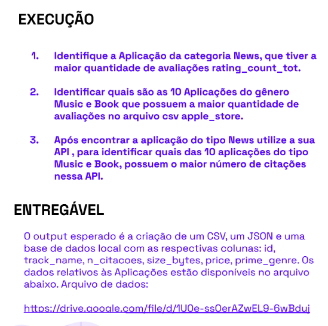

# Script python para Automatização de leitura de dados de csv para tratamento de dados

## Sobre o projeto:

Este projeto foi desenvolvido para o teste técnico de back end da empresa Cognitivo. E tem como objetivo ler uma arquivo csv que possui inúmeras linhas, e tratar os dados, criando um output com 3 arquivos sendo eles do tipo: json, csv e um banco de dados local.

## Tecnologias utilizadas

- Python
- Pandas
- ipdb (para debugar o código)
  

 

